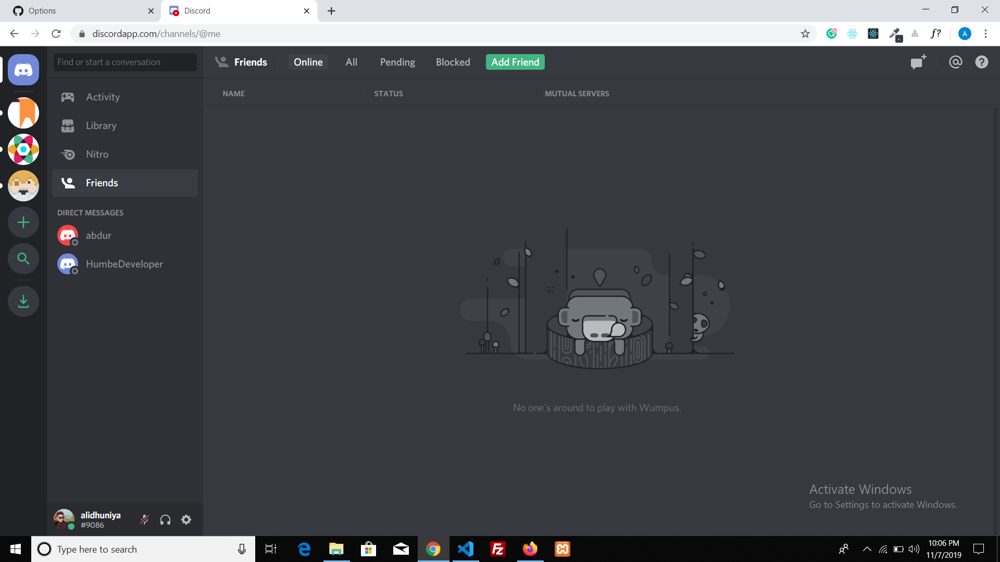
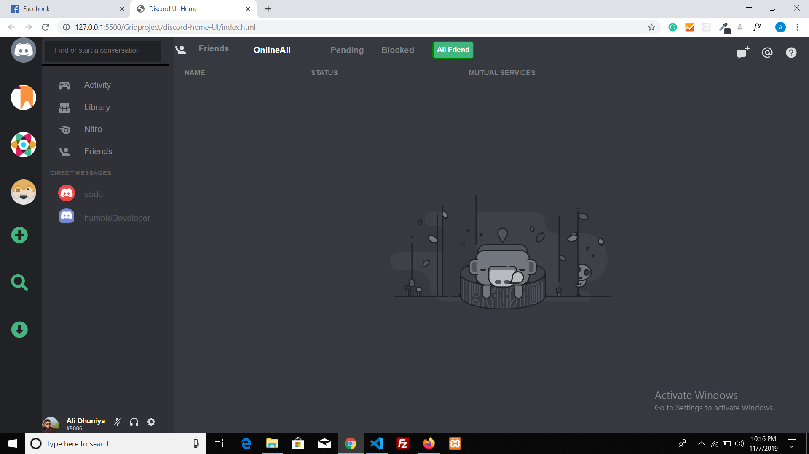

# [Demo](https://alidhuniya.github.io/Discord-home-UI-clone/)

## my official discord-home-UI

## clone_UI

### Not fully responsive. It works on my desktop(width:1530px). The main intention was to clone discord UI with basic CSS Grid understanding. CSS grid is awesome.
